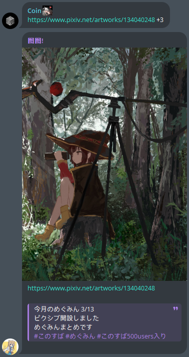

# 从`twitter`和`pixiv`抓取图片

## demo

[@get_album_bot](https://t.me/get_album_bot)

## 功能

pixiv 抓取拥有以下参数

- `+${pages}` 获取指定图片

_支持`+1`, `+1,2,5`, `+1-3`_

- `-all` 去除简介与 tag
- `-des` 去除简介
- `-tag` 去除 tag
- `-o` 仅发送原图文件
- `-O` 发送原图文件

分页可与其他参数一同使用, 如 `+4 -des`

<details>
<summary>例</summary>

## 分页

```text
https://www.pixiv.net/artworks/134040248 +2
```



## 去除所有信息

```text
lhttps://www.pixiv.net/artworks/134254939 -all
```


## 去除简介

```text
https://www.pixiv.net/artworks/134204905 -des
```


## 去除 tag

```text
https://www.pixiv.net/artworks/136673706 -tag
```


## 混合使用

```text
https://www.pixiv.net/artworks/134040248 +3 -des
```


## 仅获取原图

```text
https://www.pixiv.net/artworks/84795129 -o
```


</details>

## 搭建

请在`.env`中配置 TOKEN, 与代理(如需, 支持`socks5`, `http`, `https`)
